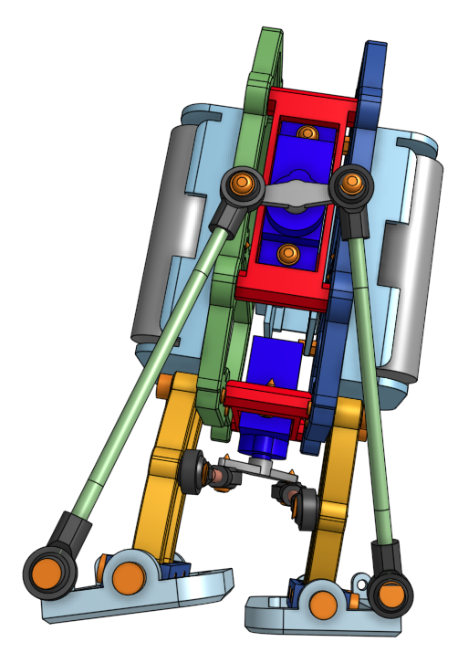

# BipedRobot

Biped robot that walks anthropomorphically using two servomotors connected via a rod to knees and feet. 

CAD files available on [Onshape](https://cad.onshape.com/documents/b0b0a56c48c90921d649a003/w/984f0bb5134c6d690e5136fb/e/ef8f33fb360a985de84ede6d?bomType=structured&renderMode=0&rightPanel=BOMPanel&uiState=6581f5c286feba03bf2c3338)

3D Print (STL) files available on [Printables](https://www.printables.com/model/683150-biped-robot)

|  |  |
|---|---|
|Trimetric | Left |

|  |  |  |
|---|---|---|
|Dimetric | Front | Right |

## Demo

## Walking Pattern

## BOM

|Item|Quantity|Vendor       |Part number      |Name                   |
|----|--------|-------------|-----------------|-----------------------|
|1   |8       |Amazon       |B07H4MG7TC M3x12 |SHCS_M3x12             |
|2   |4       |Amazon       |B07H4MG7TC M3x10 |SHCS_M3x10             |
|3   |2       |Amazon       |B07L2SF3R4 Stator|MicroServo 9gS51 Stator|
|4   |2       |Amazon       |B07L2SF3R4 Horn1 |MicroServo 9gS51 Horn  |
|5   |8       |Amazon       |B07L2SF3R4 Screw |SelfTapScrewF_M2X8     |
|6   |8       |Amazon       |B0BCFXLYK5 M3x12 |SelfTappingFHMS-M3x12  |
|7   |3       |Amazon       |B07H4MG7TC M2    |HN_M2_18-8SS           |
|8   |3       |Amazon       |B07H4MG7TC M2x8  |SHCS_M2x8              |
|9   |1       |Amazon       |B08Q3DLY39 3S    |AA Battery Holder 3S   |
|10  |5       |Amazon       |B00HZV9XKU       |Battery AA             |
|11  |4       |Amazon       |B0BCFXLYK5 M4x16 |SelfTappingFHMS-M4x16  |
|12  |4       |Amazon       |B0BCFXLYK5 M3x8  |SelfTappingFHMS-M3x8   |
|13  |1       |Amazon       |B08Q3DLY39 2S    |AA Battery Holder 2S   |
|14  |4       |Amazon       |B07H4MG7TC M2    |FW_M2                  |
|15  |2       |Amazon       |B089SH34NN 45    |RodMM_M3x45p           |
|16  |8       |Amazon       |B07Q2XLP42       |BallRodEnd_M3x15       |
|17  |2       |Amazon       |B089SH34NN 75    |RodMM_M3x75p           |
|18  |2       |CUSTOM       |BPD-301 Foot     |Foot                   |
|19  |2       |CUSTOM       |BPD-302 Ankle    |Ankle                  |
|20  |4       |CUSTOM       |BPD-303 Tibia    |Tibia                  |
|21  |1       |CUSTOM       |BPD-201B BodyL   |Body-Left              |
|22  |2       |CUSTOM       |BPD-701 Bracket  |Bracket                |
|23  |1       |CUSTOM       |BPD-201A BodyR   |Body-Right             |
|24  |1       |ElectroCookie|B07ZYTZ48N 1     |Snappable PCB 1        |
|25  |1       |HiLetGo      |NodeMCU-32S      |ESP32 Micro Controller |

- SHCS_DxL: Socket Head Cap Screw w/ Diameter and Length
- HN_D: Hex Nut w/ Diameter
- FW_D: Flat Washer w/ Diameter
- RodMM: Rod Male and Male thread